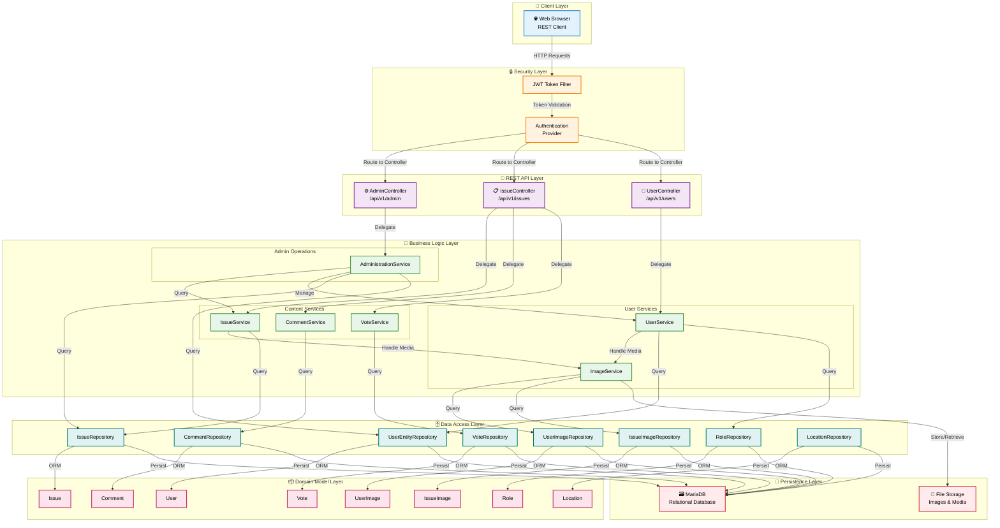

<h1>Social Responsability Portal </h1>
<h2>⚡ Quick Overview </h2>

The community-centric portal streamlines issue reporting by allowing users to register directly on the platform. After submitting essential details such as name, email, location coordinates, and preferences, users gain access to a range of features, including issue tracking, voting, commenting, and reporting. This approach promotes active community participation and information exchange for efficient issue resolution.

<b>Tech Stack: Spring Boot, Spring Data JPA, Spring Security, Java 17, JUnit and Mockito, Docker</b>

<h2>🚀 Features</h2>
<ol>
  <b>
    <li>Registration and Login:</li>
  </b>
  <ul>
    <li>User registration with essential details: fullname, email, location (geographical coordinates), radius of interest, age, gender, and optional profile picture.</li>
  </ul>
   
  <b>
    <li>Visitor Browsing:</li>
  </b>
  <ul>
    <li>View current issues on a map within the user's region of interest.</li>
  </ul>
   
  <b>
    <li>Issue Management:</li>
  </b>
  <ul>
    <li>Create and manage issues with details: title, short description, relevant picture(s), and physical location.</li>
    <li>Confirm or deny the existence of an issue using a thumbs-up and thumbs-down system.</li>
    <li>Upvote and downvote issues to determine their significance.</li>
    <li>Report new issues and track their status.</li>
  </ul>
   
  <b>
    <li>Comments and Feedback:</li>
  </b>
  <ul>
    <li>Provide feedback and comments on issues.</li>
    <li>Edit or delete one's own comments.</li>
    <li>Issues with twice as many downvotes as upvotes are archived automatically.</li>
  </ul>
   
  <b>
    <li>Statistics and Monitoring:</li>
  </b>
  <ul>
    <li>Admin overview of active and archived issues.</li>
    <li>Delete inappropriate comments.</li>
    <li>Archive issues as needed.</li>
    <li>Promote users to admin status.</li>
  </ul>
</ol>
<h2>✍️ API Endpoints</h2>
<ol>
  <b>
    <li>/api/v1/user</li>
  </b>
      

        <table>
          <tr>
            <th>Path</th>
            <th>Method</th>
            <th>QueryParam</th>
            <th>Description</th>
          </tr>
          <tr>
            <td>/</td>
            <td>POST</td>
            <td>-</td>
            <td>User registration with optional profile image</td>
          </tr>
          <tr>
            <td>/login</td>
            <td>POST</td>
            <td>-</td>
            <td>User login</td>
          </tr>
          <tr>
            <td>/profile-pic</td>
            <td>GET</td>
            <td>id</td>
            <td>Get user's profile picture by ID</td>
          </tr>
        </table>
      

      <li>/api/v1/main</li>
      

        <table>
          <tr>
            <th>Path</th>
            <th>Method</th>
            <th>QueryParam</th>
            <th>Description</th>
          </tr>
          <tr>
            <td>/issues</td>
            <td>POST</td>
            <td>-</td>
            <td>Add a new issue</td>
          </tr>
          <tr>
            <td>/issues</td>
            <td>GET</td>
            <td>pageNo, noOfItems</td>
            <td>List issues</td>
          </tr>
          <tr>
            <td>/issues/{issueId}/comments</td>
            <td>GET</td>
            <td>pageNo, itemsPerPage</td>
            <td>Get comments by issue ID</td>
          </tr>
          <tr>
            <td>/issues/{issueId}/comments</td>
            <td>POST</td>
            <td>-</td>
            <td>Add a comment to an issue</td>
          </tr>
          <tr>
            <td>/issues/{issueId}/vote</td>
            <td>POST</td>
            <td>voteValue</td>
            <td>Vote on an issue</td>
          </tr>
          <tr>
            <td>/comments/{commentId}</td>
            <td>DELETE</td>
            <td>-</td>
            <td>Delete a comment</td>
          </tr>
        </table>
      

      <li>/api/v1/admin</li>
      

        <table>
          <tr>
            <th>Path</th>
            <th>Method</th>
            <th>QueryParam</th>
            <th>Description</th>
          </tr>
          <tr>
            <td>/issues/{pageNo}</td>
            <td>GET</td>
            <td>status, pageSize</td>
            <td>Get issues by page number</td>
          </tr>
          <tr>
            <td>/issues/{issueId}/archive</td>
            <td>PUT</td>
            <td>-</td>
            <td>Archive an issue</td>
          </tr>
        </table>
      

</ol>
<h2>🏗️ Architecture</h2>

<b>N Tier Architecture:</b>

<i>Client <--> Controller <--> Service <--> DAO <--> DB</i>

## System Architecture Diagram

<ol>
 <li>Controller</li>
  - Keeps all spring REST controllers
  - Define end points
 <li>Service</li>
  - All service classes that hold business logic
 <li>DAO</li>
  - Repository layer
  - Keep all spring JPA data repository
  - Communicates with database  
</ol>

<h2>🪲 Tests Report</h2>

Tech stack: JUnit 5, Mockito
Approach: Arrange -> Act -> Assert (AAA)
Test were written for the service layer. No integration tests for the moment.

<b>Coverage report -> generated from IntellIJ by running tests with Coverage.</b>

<b>Mutation tests report -> generated by using Maven pitest plugin </b>

AI was used for generating diagrams, some small parts of code (methods names, refactoring, best practices). AI was also used in order to improve IssueServiceTest
quality after running Mutation Tests.

